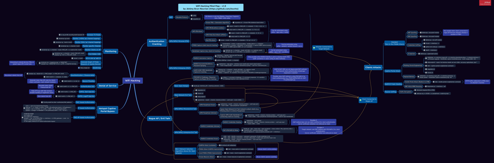
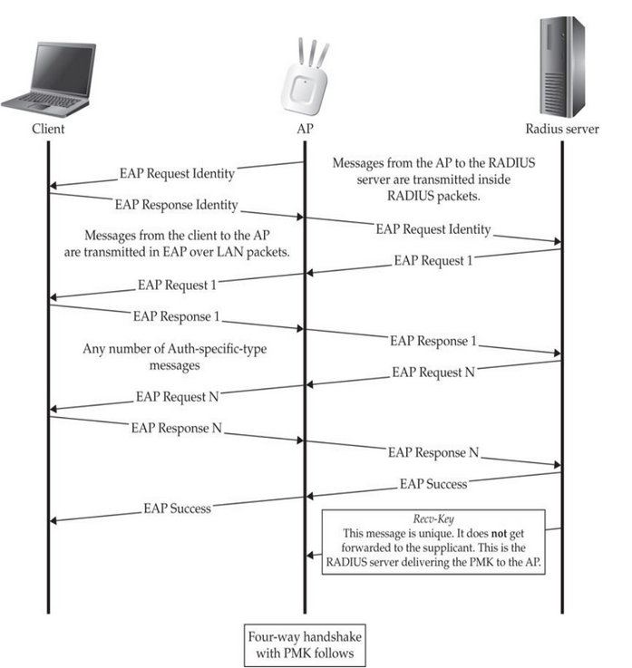
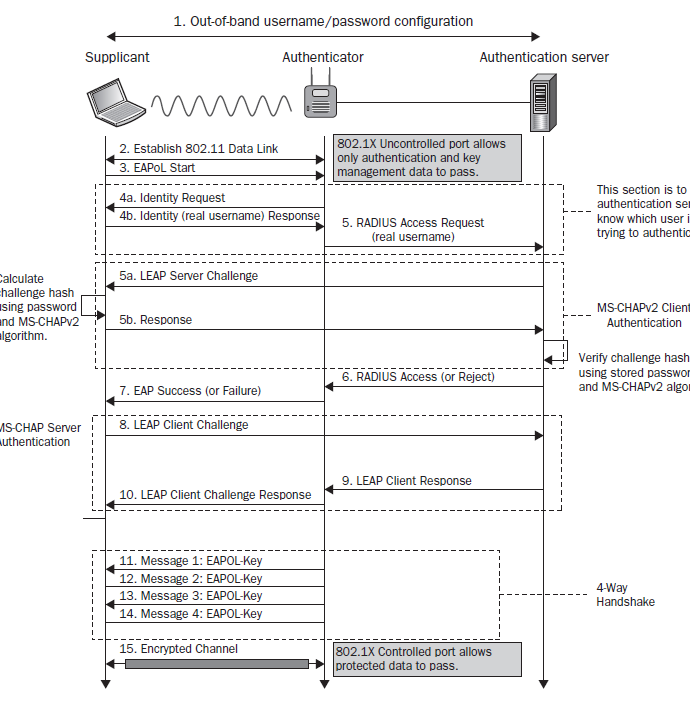
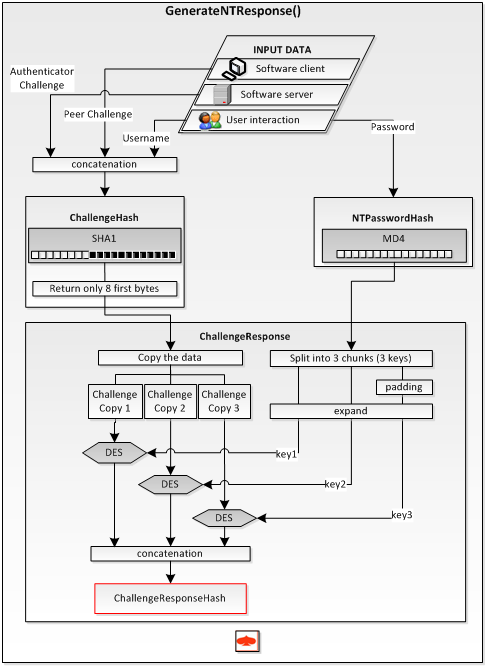

# Network Penetration Testing & Wireless Security Research

> **Authorized Security Testing Only**
> This repository is an educational wireless-security research project designed for controlled lab environments and networks that you own or have explicit permission to test.

<p align="center">
  
</p>

---

## Overview

Wireless networks are a critical attack surface across home, public, and enterprise environments. This project provides a structured methodology for assessing Wi-Fi security, identifying weaknesses in wireless configurations, analyzing attack indicators, and developing defensive controls.

Rather than focusing only on individual attacks, the project approaches Wi-Fi security as a complete assessment lifecycle:

**Reconnaissance → Wireless Enumeration → Security Analysis → Controlled Validation → Detection → Mitigation → Reporting**

The objective is to understand how wireless weaknesses can lead to unauthorized access or further compromise, while developing practical techniques for detecting and reducing those risks.

---

## Research Objectives

This project investigates:

* Wireless network discovery and security enumeration
* IEEE 802.11 security mechanisms
* WPA2/WPA3 authentication architecture
* Weak wireless configurations
* Rogue access points and Evil Twin risks
* Management-frame security
* Authentication and association behavior
* Wireless traffic analysis
* Deauthentication-related security risks
* Captive portal and phishing risks
* Wireless network segmentation
* Enterprise Wi-Fi security controls
* Detection of suspicious wireless activity
* Defensive monitoring and incident response

### Wireless Security Attack Surface

<p align="center">
  
</p>

---

## Security Assessment Methodology

### 1. Wireless Reconnaissance

The assessment begins by identifying authorized wireless infrastructure and collecting non-invasive information such as:

* SSID
* BSSID
* Channel
* Operating frequency
* Encryption/authentication type
* Signal characteristics
* Access-point relationships
* Visible wireless clients where appropriate

The objective is to establish an accurate wireless attack-surface inventory before performing any validation.

---

### 2. Security Configuration Analysis

Each discovered network is evaluated for security weaknesses.

Example assessment areas:

| Control              | Assessment               |
| -------------------- | ------------------------ |
| WPA2/WPA3            | Authentication strength  |
| WEP/WPA              | Legacy protocol exposure |
| WPS                  | Configuration risk       |
| Management frames    | Protection mechanisms    |
| Network segmentation | Guest/IoT isolation      |
| AP configuration     | Rogue-device exposure    |
| Authentication       | Enterprise vs. personal  |
| Firmware             | Patch status             |
| Monitoring           | Detection capability     |

---

## 3. Wireless Traffic Analysis

Controlled packet captures are analyzed to understand wireless communication and identify abnormal behavior.

The research examines:

* Beacon frames
* Probe requests/responses
* Authentication frames
* Association frames
* EAPOL traffic
* Management frames
* Data-frame behavior
* Channel utilization
* Unexpected access points

Tools such as **Wireshark** can be used to inspect captures and understand the relationship between wireless events and security controls.

---

## 4. Rogue Access Point & Evil Twin Research

A controlled laboratory scenario is used to study the security implications of unauthorized access points.

The experiment evaluates:

1. How a rogue AP can resemble a legitimate network
2. How users may incorrectly trust a familiar SSID
3. What information can be exposed during an unsafe connection
4. How wireless monitoring systems can detect the anomaly
5. Which organizational controls reduce the risk

The objective is **detection and defensive understanding**, not unauthorized interception.

---

## 5. Authentication Security

The project investigates authentication mechanisms used by modern wireless networks.

Areas of study include:

* WPA2-Personal
* WPA3-Personal
* WPA2-Enterprise
* EAP authentication
* PMK/PMKID concepts
* 4-way handshake architecture
* Password-strength risks
* Certificate validation
* Authentication failure monitoring

The research compares the security properties of different authentication architectures rather than simply demonstrating password attacks.

### EAP Authentication Handshake

<p align="center">
  
</p>

The general EAP authentication flow provides a foundation for understanding how wireless clients and authentication infrastructure exchange identity and authentication information.

### EAP-LEAP Handshake

<p align="center">
  
</p>

This diagram illustrates the authentication flow associated with EAP-LEAP and helps analyze the security characteristics of legacy wireless authentication mechanisms.

### MSCHAPv2 Challenge-Response

<p align="center">
  
</p>

The challenge-response exchange demonstrates the authentication mechanism used by MSCHAPv2 and provides context for evaluating authentication security and credential-protection risks.

---

## 6. Management-Frame Security

802.11 management frames play an important role in wireless network availability and security.

The project studies:

* Authentication frames
* Association/disassociation events
* Deauthentication events
* Management-frame protection
* 802.11w / Protected Management Frames
* Detection of abnormal management-frame activity

### Defensive Objective

Develop indicators that can help distinguish normal wireless activity from suspicious bursts of authentication or management events.

---

## 7. Wireless Intrusion Detection

A defensive monitoring layer can be developed to identify suspicious wireless behavior.

Potential detection indicators include:

```text
Unexpected SSID
Unexpected BSSID
Duplicate SSID
Unusual channel activity
Rapid authentication failures
Abnormal deauthentication activity
Unexpected access point
Unexpected encryption downgrade
Suspicious signal changes
```

These indicators can then be mapped to security alerts and investigation workflows.

---

# Laboratory Architecture

A safe test environment can be constructed using:

```text
                 ┌─────────────────────┐
                 │   Security Analyst  │
                 │   Linux Workstation │
                 └──────────┬──────────┘
                            │
                     Monitoring / Analysis
                            │
                 ┌──────────▼──────────┐
                 │   Wireless Lab AP   │
                 │    WPA2 / WPA3      │
                 └──────────┬──────────┘
                            │
             ┌──────────────┼──────────────┐
             │              │              │
        Test Client     Test Client     IoT Device
```

All experiments should be performed using equipment and devices controlled by the researcher.

---

# Tooling

### Wireless Analysis

* Aircrack-ng
* Kismet
* Wireshark
* hcxdumptool / hcxtools
* iw
* tcpdump

### Security Monitoring

* Zeek
* Suricata
* Wazuh
* Splunk

### Operating Environment

* Kali Linux
* Ubuntu
* Dedicated wireless test hardware

---

# Research Experiments

## Experiment 01 — Wireless Reconnaissance

**Goal:** Build an inventory of authorized wireless infrastructure.

Collect:

```text
SSID
BSSID
Channel
Frequency
Encryption
Authentication
Signal strength
```

### Expected Result

Generate a structured wireless asset inventory and identify potentially weak configurations.

---

## Experiment 02 — WPA2 vs WPA3 Security Analysis

Compare:

```text
WPA2-Personal
        ↓
4-Way Handshake
        ↓
PSK-Based Authentication

WPA3-Personal
        ↓
SAE
        ↓
Improved Resistance to Offline Password Guessing
```

Document the architectural differences and their security implications.

---

## Experiment 03 — Rogue AP Detection

Create a controlled test environment containing an authorized laboratory AP and a simulated unauthorized AP.

Investigate:

* SSID duplication
* BSSID changes
* Channel differences
* Signal anomalies
* Authentication behavior

### Detection Objective

Develop rules capable of identifying suspicious access points.

---

## Experiment 04 — Management-Frame Monitoring

Capture wireless management traffic in the lab and identify:

* Authentication events
* Association events
* Disassociation events
* Deauthentication events

Then develop detection logic for abnormal event rates.

---

## Experiment 05 — Wireless Segmentation

Evaluate whether:

```text
Guest Network
      │
      ├── Internet
      │
      └── No Internal Access

IoT Network
      │
      ├── Restricted Services
      │
      └── No Sensitive Systems

Corporate Network
      │
      └── Protected Resources
```

are appropriately isolated.

---

# Detection Engineering

Example conceptual detection rule:

```text
IF

    Same SSID
    +
    New / Unknown BSSID
    +
    Unexpected Channel
    +
    Signal strength significantly different

THEN

    Generate "Potential Rogue AP" Alert
```

Another example:

```text
IF

    Authentication / Deauthentication events
    exceed a defined baseline

THEN

    Generate "Abnormal Wireless Management Activity"
```

Thresholds should be calibrated against the normal behavior of the specific environment rather than copied blindly.

---

# Risk Assessment

Each finding can be classified using:

| Severity      | Example                                                |
| ------------- | ------------------------------------------------------ |
| Critical      | Wireless compromise exposes sensitive internal systems |
| High          | Weak authentication or significant network exposure    |
| Medium        | Rogue AP detection gaps                                |
| Low           | Configuration or monitoring weakness                   |
| Informational | Security-hardening recommendation                      |

---

# Recommended Defensive Controls

### Authentication

* Prefer WPA3 where supported
* Use strong authentication credentials
* Prefer enterprise authentication for appropriate organizational environments
* Disable legacy protocols where possible

### Network Segmentation

Separate:

```text
Corporate
Guest
IoT
Management
Security Infrastructure
```

### Monitoring

Monitor:

* New BSSIDs
* Duplicate SSIDs
* Authentication anomalies
* Wireless configuration changes
* Unexpected access points
* Management-frame anomalies

### Endpoint Protection

Users should:

* Disable automatic connection to unknown networks
* Verify SSIDs before connecting
* Avoid sensitive activity on untrusted networks
* Use MFA
* Keep operating systems and wireless drivers updated

---

# Project Deliverables

This repository aims to produce:

* Wireless reconnaissance methodology
* Security assessment checklist
* Controlled packet-capture analysis
* Wireless threat model
* Rogue AP detection methodology
* Management-frame detection logic
* Network segmentation assessment
* Risk-rating framework
* Defensive recommendations
* Technical assessment reports

---

# MITRE ATT&CK Mapping

Relevant wireless-related behaviors can be mapped to the MITRE ATT&CK framework where applicable.

Example categories include:

```text
Initial Access
Credential Access
Collection
Command and Control
Credential Phishing
Network Discovery
```

The mapping should be based on the actual techniques demonstrated or analyzed in each experiment.

---

# Responsible Disclosure & Ethics

This project is intended exclusively for:

* Personal laboratory environments
* Authorized penetration tests
* Academic research
* Security education
* Defensive security engineering

Do not test wireless networks, devices, or users without explicit authorization.

---

# Future Research

Planned extensions include:

* Automated rogue AP detection
* Wireless asset discovery dashboard
* Detection-rule generation
* Wi-Fi security scoring
* Integration with SIEM platforms
* Automated assessment reporting
* WPA2/WPA3 comparative research
* Wireless anomaly detection using machine learning
* Enterprise Wi-Fi threat modeling

---

## Project Focus

**Wireless Security Research • Penetration Testing • Detection Engineering • Threat Analysis • Defensive Security**
